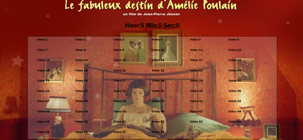

# JS30 - Tally String Times with Reduce

#### This is 18th example of JS30 course.
The aims of this lecture are 

- about how to access data-key with javascript
- how to use map(), reduce() and calculate hour, min and second respectively

I love Amelie <3
