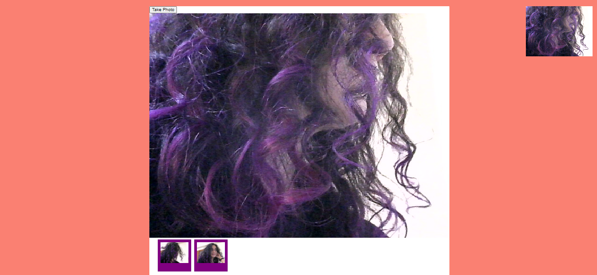

# JS30 - Webcam Fun

#### This is 19th example of JS30 course.
The aims of this lecture are 

- What is localhost
- Use npm
- Accessing our webcam
- Create a promise

It is me and my purple hair :purple_heart: