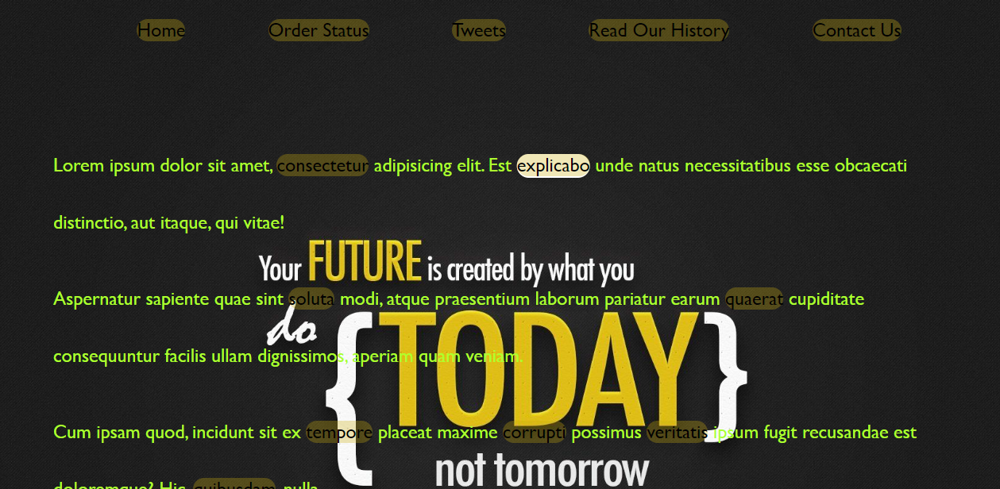

# JS30 - Follow Along Links
#### This is 22nd example of JS30 course.
The aims of this lecture are 

- Build a replica of drop down 
- Use `getBoundingClientRect()`
- Difference between `append` vs `appendChild`

:link:

[live demo](https://mervekrblt.github.io/JavaScript-30/22-Follow%20Along%20Links/index.html)