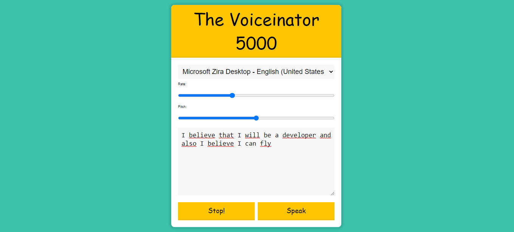

# JS30 - Speech Synthesis
#### This is 23rd example of JS30 course.
The aims of this lecture are 

- Create options for HTML select tag with JavaScript
- Use `speechSynthesisUtterance` and `speechSynthesis`

[live demo](https://mervekrblt.github.io/JavaScript-30/23-Speech%20Synthesis/index.html)

:hear_no_evil: :loudspeaker:

