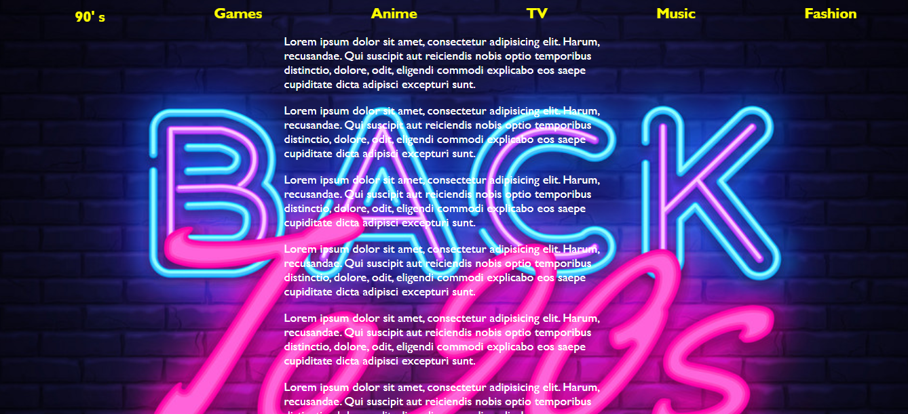
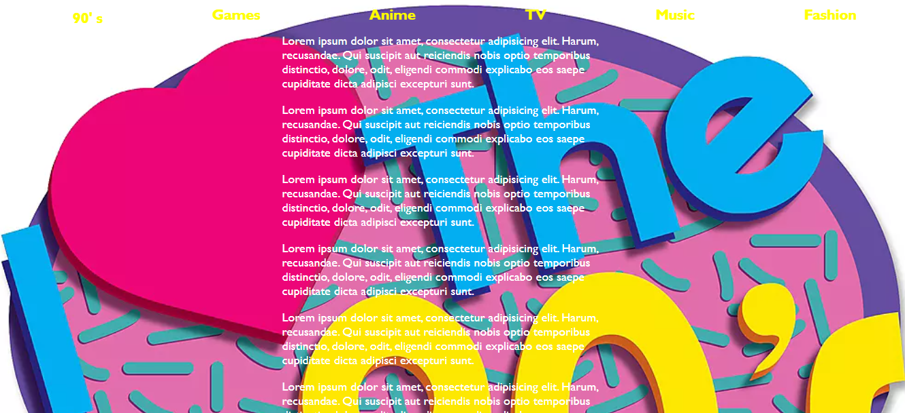

# JS30 - Sticky Nav
#### This is 24th example of JS30 course.
The aims of this lecture are 

- Create a fixed navbar
- Use `offset` and `window.scroll` properties
- Animate elements with using CSS class,  `max-width`

[live demo](https://mervekrblt.github.io/JavaScript-30/24-Sticky%20Nav/index.html)

:nine::zero: ' S