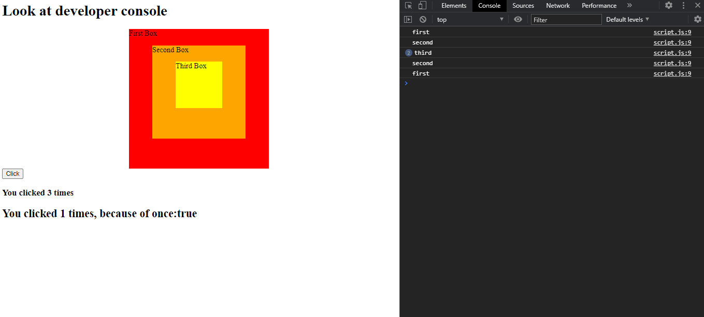

# JS30 - Event Capture
#### This is 25th example of JS30 course.
The aims of this lecture are 

- Bubbling and stop bubbling with `e.stopPropagation`
-  `document.addEventListener(event, function, {useCapture})` : `capture:true` vs `capture:false`
- Run function once with`once:true`

[live demo](https://mervekrblt.github.io/JavaScript-30/25-Event%20Capture/index.html)

Some useful links about;
- [What is event bubbling and capturing?](https://stackoverflow.com/questions/4616694/what-is-event-bubbling-and-capturing#:~:text=The%20event%20propagation%20mode%20determines,propagated%20to%20the%20inner%20elements.)

- [Bubbling and capturing](https://javascript.info/bubbling-and-capturing)
