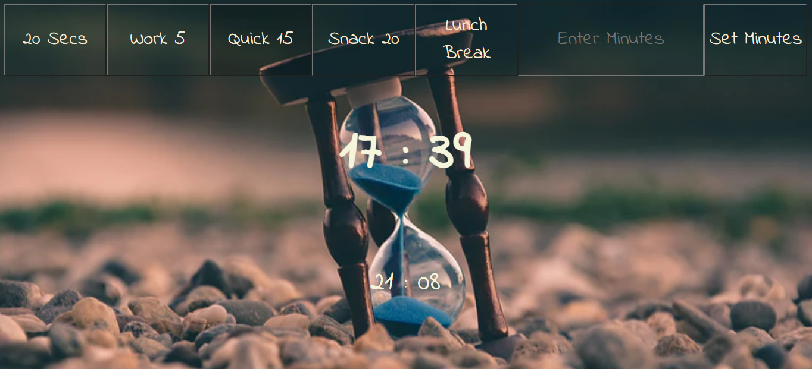

# JS30 - Countdown Clock
#### This is 29th example of JS30 course.
The aims of this lecture are 

- Use lots of functions :)
- `Date.now()` and `New Date()`
- `setInterval()`, `clearInterval()`
- Create a timer

[You can listen a lovely French song just click here](https://mervekrblt.githu addb.io/JavaScript-30/29-Countdown%20Clock/index.html)

This exercise was really tough one :muscle::grimacing::sweat_drops::octocat: