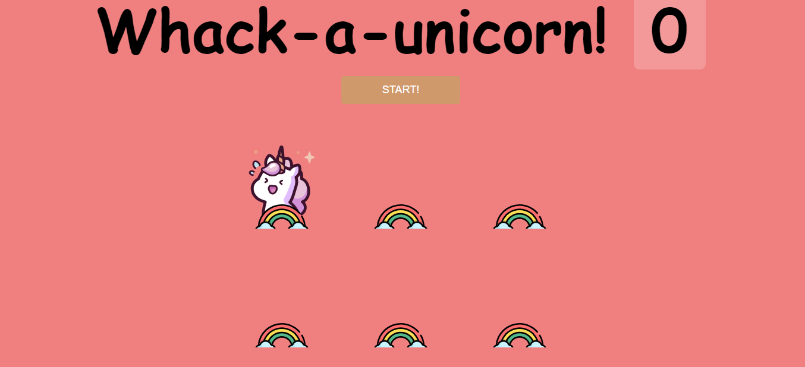

# JS30 - Whack a Unicorn
#### This is the last example of JS30 course.
The aims of this lecture are 

- Use svg 
- `e.isTrusted`
- Use `setTimeout` to set game duration, to unicorn's display time

[live demo](https://mervekrblt.github.io/JavaScript-30/30-Whack%20a%20Unicorn/index.html)

Have fun :Confetti Ball: